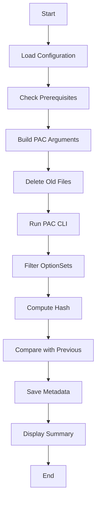

# 📘 EarlyBound Generator - Complete Documentation

## 🎯 **Overview**

A professional, production-ready EarlyBound class generator for Dynamics 365 / Dataverse that generates entity classes, optionsets, messages/actions, and service context using Microsoft PAC CLI.

### **Key Features**
- ✅ **Fast Generation** - One PAC CLI call (~30-60 seconds)
- ✅ **Smart Filtering** - Filter entities, actions, and optionsets
- ✅ **Post-Processing** - Automatically deletes unwanted optionsets
- ✅ **Change Detection** - MD5 hash comparison to detect changes
- ✅ **Detailed Logging** - Timestamped console output + log file
- ✅ **Preview Mode** - See what will be generated before running
- ✅ **.NET 10 Compatible** - Works with latest .NET

---

## 🚀 **Quick Start**

### **1. Prerequisites**
```powershell
# Install PAC CLI
winget install Microsoft.PowerPlatformCLI

# Authenticate
pac auth create --url https://your-env.crm4.dynamics.com/
```

### **2. Configure**
Edit `earlybound.configuration.json`:
```json
{
  "dataverseUrl": "https://your-env.crm4.dynamics.com/",
  "namespace": "Your.Domain.EarlyBound",
  "serviceContextName": "CrmServiceContext",
  "outputDirectory": "../EarlyBoundClasses",
  
  "filters": {
    "entities": ["account", "contact", "invoice"],
    "actions": ["my_CustomAction"],
    "optionSets": ["account_industrycode"]
  }
}
```

### **3. Generate**
```powershell
# Preview first
.\earlybound.ps1 -Preview

# Generate
.\earlybound.ps1
```

### **4. Build**
```powershell
dotnet build
```

---

## 📁 **Project Structure**

```
EarlyBoundFactory/
├── earlybound.ps1                    ← Main generator script
├── earlybound.configuration.json     ← Configuration file
├── earlybound.metadata.json          ← Hash metadata (auto-generated)
├── README_EarlyBound.md             ← This file
├── OPTIONSETS-LIMITATION.md         ← PAC CLI limitation docs
└── OPTIONSET-FILTERING-SOLUTION.md  ← How filtering works

../EarlyBoundClasses/                 ← Output directory
├── Entities/
│   ├── account.cs
│   ├── contact.cs
│   └── invoice.cs
├── OptionSets/
│   └── account_industrycode.cs
├── Messages/
│   └── my_CustomAction.cs
├── CrmServiceContext.cs
├── EntityOptionSetEnum.cs
└── earlybound.log                    ← Generation log
```

---

## ⚙️ **Configuration**

### **earlybound.configuration.json**

```json
{
  "dataverseUrl": "https://albadry-dev.crm4.dynamics.com/",
  "namespace": "Albadry.D365.Domain.EarlyBound",
  "serviceContextName": "CrmServiceContext",
  "outputDirectory": "../EarlyBoundClasses",

  "filters": {
    "entities": [
      "account",
      "contact",
      "activitypointer"
    ],
    "actions": [
      "adx_AzureBlobStorageUrl",
      "msdyn_CloneAttachmentsPluginAction"
    ],
    "optionSets": [
      "msdyn_flow_approval_priority",
      "powerpagelanguages",
      "fullsyncstate"
    ]
  },

  "_comments": {
    "optionSets": "PAC CLI generates ALL optionsets, then the script deletes the ones NOT in this list. Empty array [] = don't generate any optionsets."
  }
}
```

### **Configuration Options**

| Property | Description | Required | Example |
|----------|-------------|----------|---------|
| `dataverseUrl` | Your Dataverse environment URL | ✅ Yes | `https://yourorg.crm.dynamics.com/` |
| `namespace` | .NET namespace for generated classes | ✅ Yes | `Your.Domain.EarlyBound` |
| `serviceContextName` | Name of the service context class | ✅ Yes | `CrmServiceContext` |
| `outputDirectory` | Where to generate files | ✅ Yes | `../EarlyBoundClasses` |
| `filters.entities` | Entities to generate | ⚠️ Optional | `["account", "contact"]` |
| `filters.actions` | Custom actions to generate | ⚠️ Optional | `["my_CustomAction"]` |
| `filters.optionSets` | OptionSets to keep | ⚠️ Optional | `["status_code"]` |

### **Filter Behavior**

| Filter Value | Result |
|--------------|--------|
| `["item1", "item2"]` | Only generates specified items |
| `[]` (empty array) | Generates ALL (for entities/actions) or NONE (for optionsets) |
| Not specified | Same as empty array |

---

## 🎮 **Usage**

### **Basic Commands**

```powershell
# Preview mode (no generation)
.\earlybound.ps1 -Preview

# Generate with config filters
.\earlybound.ps1

# Help
Get-Help .\earlybound.ps1 -Full
```

### **Advanced Examples**

```powershell
# Generate only specific entities (override config)
.\earlybound.ps1 -Entities account,contact

# Generate only specific actions (override config)
.\earlybound.ps1 -Actions my_CustomAction,another_Action

# Generate with specific optionsets (override config)
.\earlybound.ps1 -OptionSets status,statecode

# Preview with overrides
.\earlybound.ps1 -Preview -Entities account
```

---

## 🔍 **How It Works**

### **Generation Process**



### **Step-by-Step Breakdown**

#### **1. Configuration Loading**
- Reads `earlybound.configuration.json`
- Validates required fields
- Prepares filters

#### **2. Prerequisites Check**
- Verifies PAC CLI installation
- Checks active authentication
- Validates environment access

#### **3. PAC CLI Execution**
```powershell
pac modelbuilder build `
  --environment https://yourorg.crm4.dynamics.com/ `
  --namespace Your.Namespace `
  --serviceContextName CrmServiceContext `
  --outdirectory ./EarlyBoundClasses `
  --entitynamesfilter "account;contact;invoice" `
  --messagenamesfilter "my_Action" `
  --generateGlobalOptionSets
```

#### **4. OptionSet Post-Processing** (🔥 Key Feature)
**Problem:** PAC CLI doesn't support filtering optionsets  
**Solution:** Generate ALL (~100 files), then delete unwanted ones

```powershell
# PAC generates all optionsets
Total: 100 files

# Script keeps only specified ones
Kept: 3 files (from config)
Deleted: 97 files (not in config)
```

#### **5. Change Detection**
- Computes MD5 hash of all generated files
- Compares with previous generation
- Detects if any files changed
- Stores hash in `earlybound.metadata.json`

#### **6. Logging**
- **Console:** Colored, timestamped output
- **File:** Complete log with PAC output

---

## 📊 **Output**

### **Console Output**
```
================================================================
  EarlyBound Generator for Dynamics 365
================================================================

  Version:   2.0 (Fast & Filtered)
  Date:      2024-03-10 14:30:00


--- Loading Configuration ---
[14:30:00] [INFO]  Configuration file: earlybound.configuration.json
[14:30:00] [OK]    Configuration loaded successfully

--- Checking Prerequisites ---
[14:30:00] [INFO]  Verifying PAC CLI installation...
[14:30:02] [OK]    PAC CLI found: Microsoft PowerPlatform CLI

--- Configuring Filters ---
[14:30:02] [INFO]  Environment: https://yourorg.crm4.dynamics.com/
[14:30:02] [INFO]  Namespace: Your.Domain.EarlyBound

  Filters Applied:
    Entities:   3 selected
      - account
      - contact
      - invoice

--- Generating Early-Bound Classes ---
[14:30:05] [INFO]  Starting PAC modelbuilder...
[14:30:45] [OK]    PAC generation completed in 40.2 seconds

--- Filtering OptionSets ---
[14:30:45] [INFO]  Applying OptionSet filter...
[14:30:45] [OK]    Filtered: kept 3 of 100 optionsets (deleted 97)

================================================================
  Generation Complete - Summary
================================================================

  Your early-bound classes are ready!

  [Generation Statistics]
    - Entities:     3 files
    - Messages:     1 files
    - OptionSets:   3 files
    - Context:      1 file (CrmServiceContext.cs)
    - Enums:        1 file (EntityOptionSetEnum.cs)

  [Entity Classes]
    + account
    + contact
    + invoice

[14:30:46] [OK]    All done! Happy coding! 🚀
```

### **Log File** (`earlybound.log`)
```
================================================================
Dynamics 365 Early-Bound Generation Log
================================================================
Timestamp:    2024-03-10 14:30:00
Environment:  https://yourorg.crm4.dynamics.com/
Namespace:    Your.Domain.EarlyBound
Output Dir:   C:\...\EarlyBoundClasses

================================================================
Configuration Filters:
================================================================
Entities (3):
  - account
  - contact
  - invoice

Actions (1):
  - my_CustomAction

OptionSets (3):
  - account_industrycode
  - contact_statuscode
  - opportunity_salesstagecode

================================================================
PAC CLI Output:
================================================================
[PAC CLI detailed output here...]

================================================================
OptionSet Post-Processing Filter
================================================================
Total Generated by PAC CLI:  100
Filtered (kept):             3
Deleted (not in filter):     97

Kept OptionSets:
  + account_industrycode
  + contact_statuscode
  + opportunity_salesstagecode

================================================================
Generation Summary
================================================================
Completion Time:   2024-03-10 14:30:46
Total Duration:    40.2 seconds

Files Generated:
  Entities:      3 files
  Messages:      1 files
  OptionSets:    3 files
  Context:       1 file
  Enums:         1 file

Total Files:       8
Output Directory:  C:\...\EarlyBoundClasses
Changes Detected:  Yes

================================================================
Status: SUCCESS
================================================================
Generated by EarlyBound Generator v2.0
================================================================
```

---

## ⚠️ **Important: OptionSet Filtering**

### **The Problem**
PAC CLI **does NOT support** filtering optionsets:
```powershell
# ❌ This parameter doesn't exist:
--optionsetnamesfilter "option1;option2"

# ✅ Only this exists:
--generateGlobalOptionSets  # Generates ALL (~100 files)
```

### **Our Solution**
1. ✅ Generate ALL optionsets with PAC CLI
2. ✅ Read filter from configuration
3. ✅ Delete files NOT in the filter
4. ✅ Keep only specified optionsets

### **Example**
```json
"optionSets": [
  "account_industrycode",
  "contact_statuscode"
]
```

**Result:**
- PAC generates: 100 optionset files
- Script keeps: 2 files (from config)
- Script deletes: 98 files (not in config)

### **Recommendations**

| Scenario | Configuration | Result |
|----------|--------------|---------|
| **Don't need optionsets** | `"optionSets": []` | 0 files generated |
| **Need specific optionsets** | `"optionSets": ["option1"]` | Only specified ones |
| **Need all optionsets** | `"optionSets": ["*"]` | All ~100 files |

---

## 🔧 **Troubleshooting**

### **Common Issues**

#### **1. PAC CLI Not Found**
```
[ERROR] PAC CLI not found!
```
**Fix:**
```powershell
# Install PAC CLI
winget install Microsoft.PowerPlatformCLI

# Or download from:
# https://aka.ms/PowerPlatformCLI

# Verify installation
pac --version
```

#### **2. Not Authenticated**
```
[ERROR] No active PAC authentication!
```
**Fix:**
```powershell
# Authenticate
pac auth create --url https://yourorg.crm4.dynamics.com/

# Verify
pac auth list
# Look for * next to active profile
```

#### **3. No Files Generated**
**Possible causes:**
- Empty entity filter → Check config
- Wrong entity names → Verify in Dataverse
- PAC CLI error → Check log file

**Fix:**
```powershell
# Check configuration
Get-Content earlybound.configuration.json

# Check log
Get-Content ..\EarlyBoundClasses\earlybound.log

# Try with no filters first
# Edit config: "entities": []
.\earlybound.ps1
```

#### **4. Build Errors After Generation**
```
CS0579: Duplicate attribute
```
**Fix:**
```xml
<!-- In .csproj -->
<GenerateAssemblyInfo>false</GenerateAssemblyInfo>
```

#### **5. Generation Failed**
```
[ERROR] PAC CLI generation failed!
```
**Fix:**
```powershell
# Check detailed error in log
Get-Content ..\EarlyBoundClasses\earlybound.log

# Common fixes:
# - Verify environment URL
# - Check authentication
# - Validate entity names
# - Ensure network connection
```

---

## 📚 **Advanced Topics**

### **Change Detection**

The script uses MD5 hashing to detect if generated files changed:

```powershell
# First run
Hash: ABC123...
Metadata saved

# Second run (no changes in Dataverse)
Hash: ABC123... (same)
Result: "No changes detected"

# Third run (entity modified in Dataverse)
Hash: XYZ789... (different)
Result: "Changes detected - files updated"
```

**Benefits:**
- Know when Dataverse metadata changed
- Avoid unnecessary Git commits
- Track generation history

### **Metadata File**

`earlybound.metadata.json` stores:
```json
{
  "folderHash": "ABC123...",
  "generatedAt": "2024-03-10T14:30:46Z",
  "filters": {
    "entities": ["account", "contact"],
    "actions": [],
    "optionSets": []
  }
}
```

### **Custom PAC Arguments**

To add custom PAC CLI arguments, modify the script:

```powershell
# In earlybound.ps1, find:
$pacArgs = @(
    'modelbuilder', 'build',
    '--environment', $config.dataverseUrl,
    # ... existing args
)

# Add your custom argument:
$pacArgs += '--emitfieldsclasses'  # Generate Fields classes
$pacArgs += '--emitentityetc'     # Include Entity Type Codes
```

### **Integration with CI/CD**

```yaml
# Azure DevOps pipeline
steps:
- task: PowerShell@2
  inputs:
    filePath: 'src/Domain/YourDomain/EarlyBound/EarlyBoundFactory/earlybound.ps1'
    errorActionPreference: 'stop'
  displayName: 'Generate EarlyBound Classes'

- task: DotNetCoreCLI@2
  inputs:
    command: 'build'
  displayName: 'Build Project'
```

---

## 📖 **Best Practices**

### **1. Version Control**
```bash
# Commit generated files
git add src/Domain/*/EarlyBound/
git commit -m "Update EarlyBound classes - Added new_entity"

# Add to .gitignore
echo "earlybound.metadata.json" >> .gitignore
echo "earlybound.log" >> .gitignore
```

### **2. Regular Updates**
- Regenerate after Dataverse schema changes
- Review changes before committing
- Test build after generation

### **3. Entity Filtering**
```json
// ✅ Good: Specific entities
"entities": ["account", "contact", "opportunity"]

// ❌ Bad: Too many entities (slow generation)
"entities": []  // Generates ALL entities (100+)

// ✅ Better: Only what you use
"entities": ["account", "contact"]
```

### **4. OptionSet Management**
```json
// ✅ Good: Only needed optionsets
"optionSets": ["account_industrycode", "contact_statecode"]

// ⚠️ Acceptable: All optionsets (if you need them)
"optionSets": ["*"]

// ✅ Best: None (define manually as needed)
"optionSets": []
```

### **5. Namespace Conventions**
```json
// ✅ Good
"namespace": "YourCompany.D365.Domain.EarlyBound"

// ✅ Also good
"namespace": "YourProject.Models.Dataverse"

// ❌ Avoid
"namespace": "EarlyBound"  // Too generic
```

---

## 🎓 **FAQs**

### **Q: How long does generation take?**
**A:** Typically 30-60 seconds depending on:
- Number of entities
- Number of optionsets
- Network speed
- Dataverse instance performance

### **Q: Can I generate for multiple environments?**
**A:** Yes! Create multiple config files:
```powershell
# Development
.\earlybound.ps1 -ConfigFile dev-config.json

# Production
.\earlybound.ps1 -ConfigFile prod-config.json
```

### **Q: What if I need all optionsets?**
**A:** Set `"optionSets": ["*"]` or leave array with one item:
```json
"optionSets": ["dummy"]  // Keeps all 100 files
```

### **Q: Can I customize the generated code?**
**A:** No, PAC CLI generates code. But you can:
- Use partial classes to extend generated classes
- Create extension methods
- Wrap in helper classes

### **Q: How do I update to new entity attributes?**
**A:** Just regenerate:
```powershell
.\earlybound.ps1
dotnet build
```

### **Q: Does this work with .NET Framework?**
**A:** Yes! Change target framework in `.csproj`:
```xml
<TargetFramework>net48</TargetFramework>
```

---

## 📝 **Changelog**

### **Version 2.0** (Current)
- ✅ Complete rewrite for simplicity
- ✅ Added OptionSet post-processing filter
- ✅ Added detailed timestamped logging
- ✅ Added change detection with MD5 hashing
- ✅ Added preview mode
- ✅ Improved error messages
- ✅ .NET 10 support

### **Version 1.0** (Legacy)
- Basic PAC CLI wrapper
- No filtering
- No logging
- Manual configuration

---

## 🤝 **Contributing**

To improve this generator:

1. **Report Issues:** Document any bugs or limitations
2. **Suggest Features:** Propose improvements
3. **Submit PRs:** Code contributions welcome
4. **Update Docs:** Keep documentation current

---

## 📞 **Support**

### **Documentation Files**
- `README_EarlyBound.md` - This complete guide
- `OPTIONSETS-LIMITATION.md` - PAC CLI limitation details
- `OPTIONSET-FILTERING-SOLUTION.md` - How filtering works

### **Resources**
- PAC CLI Docs: https://aka.ms/PowerPlatformCLI
- Dataverse API: https://docs.microsoft.com/power-apps/developer/data-platform/

### **Quick Links**
- [Install PAC CLI](https://aka.ms/PowerPlatformCLI)
- [Dataverse Documentation](https://docs.microsoft.com/power-apps/developer/data-platform/)
- [.NET SDK](https://dotnet.microsoft.com/download)

---

## ✅ **Summary**

This EarlyBound generator provides:
- ✅ **Fast** - Single PAC CLI call
- ✅ **Filtered** - Entities, actions, optionsets
- ✅ **Smart** - Post-processing OptionSet filter
- ✅ **Tracked** - Change detection with hashing
- ✅ **Logged** - Detailed console + file logging
- ✅ **Simple** - Easy configuration
- ✅ **Modern** - .NET 10 compatible

**Ready to use in production!** 🚀

---

**Generated by:** EarlyBound Generator v2.0  
**Last Updated:** 2024-03-10  
**License:** MIT
